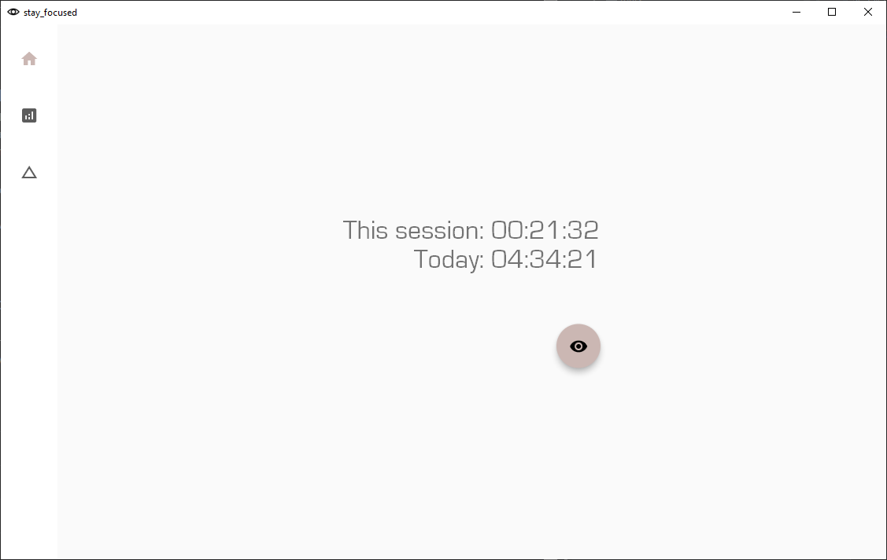

## Stay focused mate



### What this is

A small program to help me stay focused

### What can it do

It records the number of hours you focused for the day, and displays a history of this record.

It can also blacklist certain internet hosts, note you will need to run it in administrator mode.

### How does it work

Ask me later

### How do I use this

You'll need to have the [desktop development workflow](https://flutter.dev/desktop) setup for flutter.

Then, run

```
flutter build windows
flutter pub run msix:create
```

and follow the instructions to install.

NB I have ONLY tested this program for windows.